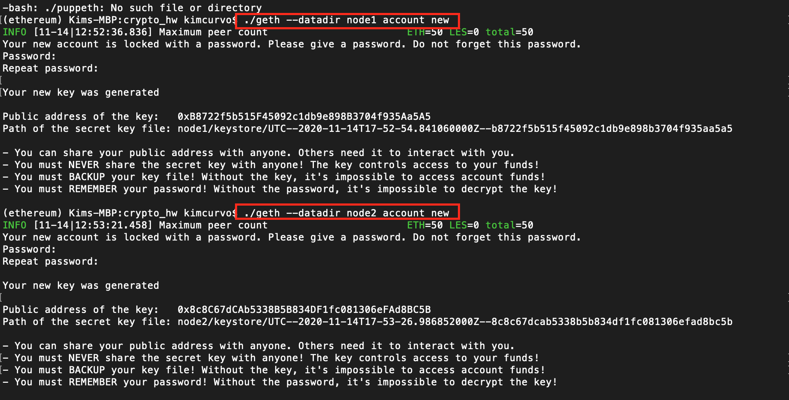
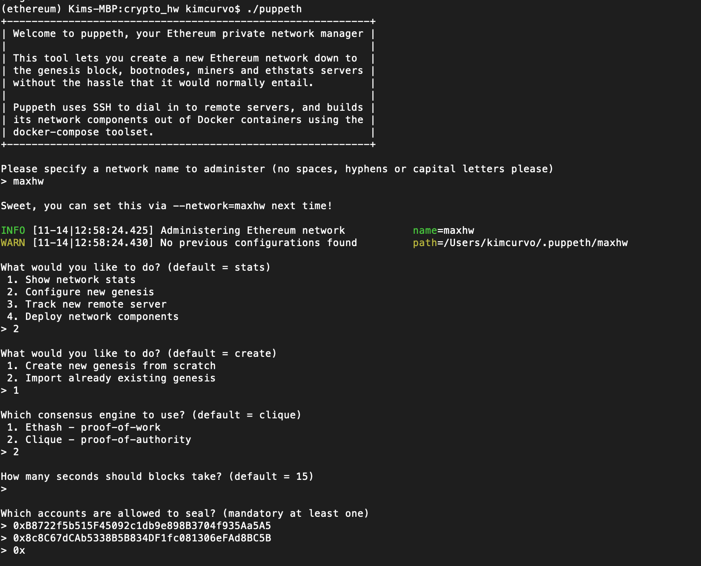
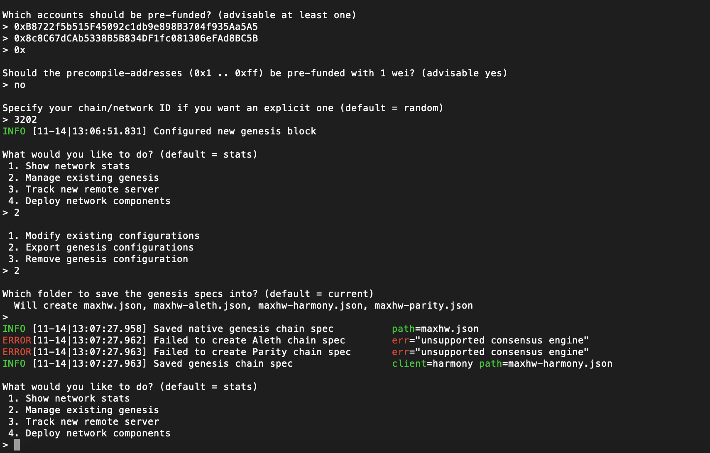
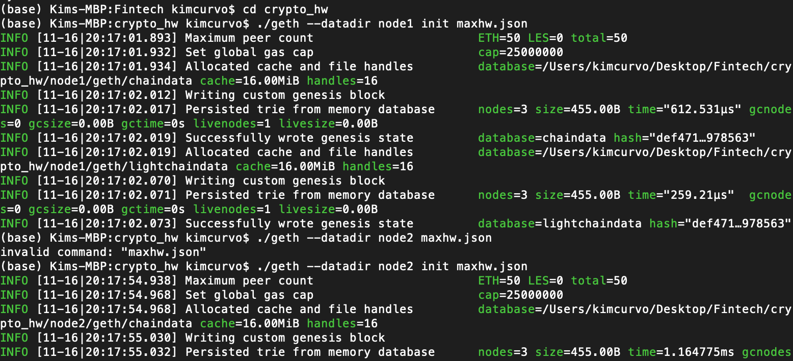
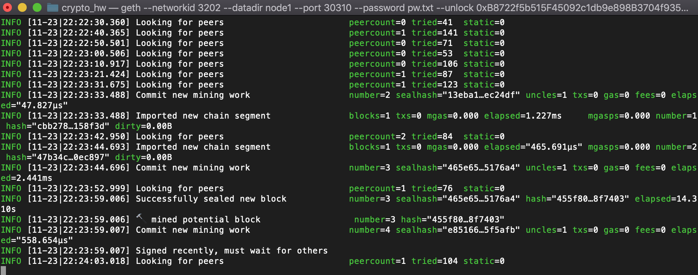
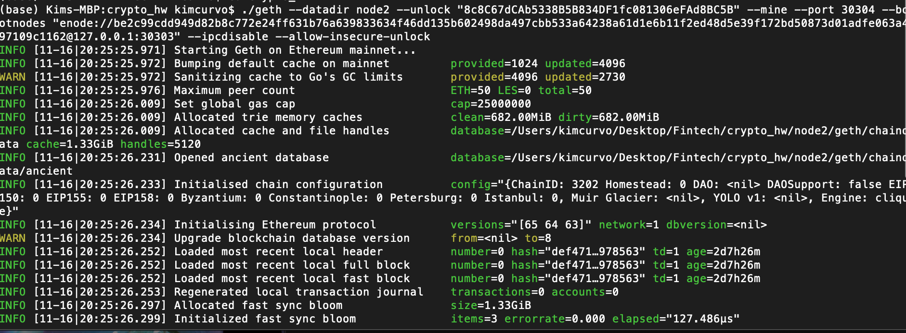
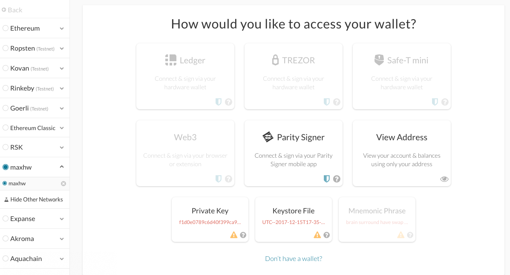
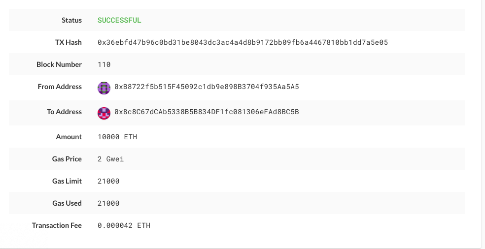

# Developing a Proof of Authority blockchain 

Creating a blockchain 

Two nodes were initialized, node1 and node2. 

After initializating both nodes, we created the genesis for a Proof of Authority blockchain. 

With the PoA block created, it was time to initialize both nodes to mine. 

After mining and with the wallet filled with ETH, it was time for the first transaction. 

We first created our own network and then transfered the crypto from one wallet to the other. 

